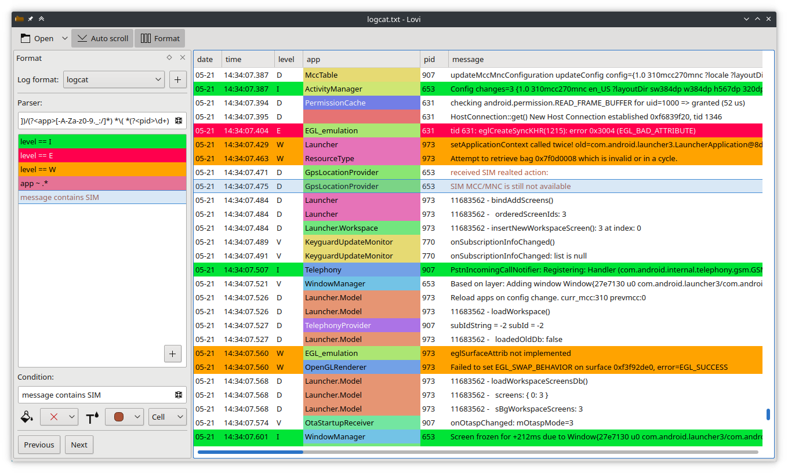

# LOVI

## Introduction

Lovi is a log file viewer.



Lovi works by splitting log files in columns, and colorizing certain lines or cells, depending on user-defined highlights.

## Motivation

I often have to analyze application log files at work. Not the usual server logs running on your infrastructure, rather archive of log files sent by customers when they have a problem with our application.

I spend a lot of time searching for unusual behaviors, but it often feels like looking for a needle in a haystack, especially when the investigation requires diving into Android logcat (we sell Android emulators at work). To help me with this I wanted an application which would let me highlight various patterns using different colors.

I tried a few applications, but could not find one with these features. I tried at least these:

- [glogg](http://glogg.bonnefon.org/): Qt user interface, log-file agnostic
- [lnav](https://lnav.org/): console user interface, log-file agnostic
- [goaccess](https://goaccess.io/): console or HTML user interface, web server oriented

## Features

- Multiple highlights.
- Multiple log formats. A log format contains the parser definition to split the log file in columns as well as the various highlights defined for it. Lovi remembers which log format was used for which file.
- Auto-scroll mode, similar to `tail -f`.
- Can work on local files and stdin.

## Defining the parser

The parser definition is a regular expression with named groups. For example, given the following log lines:

```
12:34:56 myapp:1234 debug Start app
15:16:54 myapp:1234 warning Something went wrong
```

To create a parser which splits this into time, app, pid, level and messages columns, you could use the following definition:

```
(?<time>\d+:\d+:\d+) (?<app>\w+):(?<pid>\d+) (?<level>\w+) (?<message>.*)
```

The log file view updates in real time as you type.

## Defining highlights

An highlight is made of two elements: the highlight condition and the highlight colors. The highlight condition uses a simple DSL inspired from Wireshark DSL. Its syntax is:

```
<column> <operator> <criteria>
```

- `column` is the name of a column defined in the log parser
- `operator` is one of:
	- `=` or `==`: exact match
	- `contains`: the cell must contain the "criteria" string
	- `~`: the cell must match the "criteria" regular expression
- `criteria` is the string to match. If it contains spaces, you must surround it with `"`. To use a literal `"`, escape it by prefixing it with another `"`. Lovi does not use `\` to escape strings because it makes entering regular expression painful.

## Known limitations

Lovi currently loads all the log file in memory, so you should not try to use it on multiple gigabyte log files. This is not a major limitation for me now given my use-case, but that should be fixed nevertheless.

Lovi does not support compressed log files for now.

## Building

Lovi uses the Qt framework and a few other dependencies:

- [CMake](https://cmake.org)
- [KF5GuiAddons](https://download.kde.org)
- [qpropgen](https://github.com/agateau/qpropgen), bundled as a submodule, so you just need to install its dependencies (see below)

Make sure you have the submodules:

```
git submodule update --init --recursive
```

Install qpropgen dependencies:

```
pip3 install -r third-party/qpropgen/requirements.txt`
```

Create a build dir:

```
mkdir build
cd build
```

Build it:

```
cmake ..
make
```

Either install it:

```
make install
```

Or generate deb and rpm packages to install:

```
make package
```
